# Chat with Perplexity — 不用 Perplexity API key 也能用

[English](README.md) | [中文](README.zh-CN.md)

**不用 Perplexity API key 也能用 Perplexity**：这个非官方开源 agent skill 直接驱动
**Perplexity 网页版**——搜索、点击、等待、提取——用你已登录的账号。一条命令自动跑完整个
任务，并为每一步留下收据（receipt）。决策循环与站点无关，思路
[Inspired by jev-ultrafast](https://github.com/browser-use/jev-ultrafast)（独立实现）。

> **key 的诚实说法**：不需要 **Perplexity** API key（这正是卖点——用网页订阅
> 而非按次 API 计费）。但需要一个免费的 TypeSafe Jev 决策 key；升级应答器
> 接受任意 OpenAI 兼容 LLM key（可选——实测 Xiaomi MiMo 2.6 series）。
> 见 [依赖](#依赖)。

> 非官方项目，与 Perplexity AI, Inc. 无关联、未获背书。
> "Perplexity" 是 Perplexity AI, Inc. 的商标。

## 为什么

- **无 Perplexity API key、无按次 API 费用**——它操作的就是你订阅下的网页版。
- **自主快循环**——快照 → 编号元素表 → 一次小模型调用选出（操作，目标）→ 确定性执行
  → 有界等待 → 循环直到「独立验证」的 DONE。大模型从不待在循环里。
- **收据而非感觉**——fail-closed 的 JSONL 证据链：每一步的决策、门为何拒掉某决策
  （`pre_gate`）、哪级点击阶梯生效、最终答案如何被验证。
- **Built with Xiaomi MiMo 2.6 series，模型层天生无关**——MiMo 2.6 实测：端到端
  **24.5 分钟 → 77 秒（19.1×）**（对比人工应答基线）；升级应答 **2–3 秒**
  （原 144–302 秒）；决策 698ms。任意 OpenAI 兼容模型即插即用——唯一硬性
  key 只有 TypeSafe Jev。

## 你能得到什么

- `jevw run --goal … --url …`——一条命令的任务执行器（搜索、填表、提交、流式等待、提取）
- `scripts/jevw-escaler.py`——即时升级应答器（小模型 ~2–3 秒作答；`done_verify` 零成本）
- 覆盖矩阵与证据：[`docs/COVERAGE.md`](docs/COVERAGE.md)
- 实测数字：[`docs/2026-09-24-speed-report.md`](docs/2026-09-24-speed-report.md)

## 不止快：帮 Perplexity 答好

快是钩子，答案质量才是目的。`--recipe finance|tech|research` 会把社区验证过的答题规则
包进你的问题（每句事实后必须带引用、证据不足标注 unsupported、时效窗口、冲突发现显式
标注），答完还有两个自动守卫：**静默换模型检测**（社区第一大怨念）和**装饰性引用检测**
（列 15 条来源正文只用 3 条就是凑数）。v1.1 双双落地（70 测试全绿）。规则出处见
[`references/perplexity-playbook.md`](references/perplexity-playbook.md)。

## 依赖

- WebBridge 兼容的浏览器桥 daemon（已测：kimi-webbridge），浏览器里 Perplexity 已登录
- [TypeSafe](https://typesafe.ai) Jev 决策 key（快速决策头——唯一必需的 key）
- 可选：任意 OpenAI 兼容 LLM 端点（升级应答器，`JEZW_ESCALER_URL` /
  `JEZW_ESCALER_MODEL` / `JEZW_ESCALER_API_KEY`；实测 Xiaomi MiMo 2.6 flash）

## 安装

```bash
npx skills add mfang0126/perplexity-web-bridge   # 77 种 agent 通用
```

## 60 秒上手

```bash
jevw run \
  --goal "研究 适合初创团队的数据库 选型 性能 成本 建议 风险" \
  --url https://www.perplexity.ai/ \
  --site perplexity \
  --escalate-cmd "python3 scripts/jevw-escaler.py"
```

输出：一行 JSON（`status`、提取出的 `answer`、周期/升级计数、墙钟时间）+ 收据文件。

## 工作原理


*（源文件：[`docs/assets/loop.mmd`](docs/assets/loop.mmd) — "Inspired by jev-ultrafast"）*

1. **观察**——一次 JS 快照压成编号元素表（原始 DOM 永不进模型）
2. **决策**——一次 Jev 前向 ~0.7–0.9 秒分类（操作，目标）；结构门对照表格校验
   （`op ⊆ 行 ops`）
3. **执行**——3 级效果验证点击阶梯（trusted → synthetic → CDP）；静默无效自动降级
4. **安定与循环**——有界等待，WAIT 不耗预算；卡死/低置信/断供升级给快速应答器
5. **验证**——DONE 独立验证，且 goal 关键词必须出现在提取的答案里

完整矩阵（6 个操作原语、5 项循环保证、按证据分级的组合场景）：
[`docs/COVERAGE.md`](docs/COVERAGE.md)。

## 对比

| | Perplexity API | perplexity-web-mcp 类 | 裸 Playwright | **本 skill** |
|---|---|---|---|---|
| 免 Perplexity API key | ✗ | ✓ | ✓ | ✓ |
| 用你现有订阅 | ✗ | ✓ | ✓ | ✓ |
| 多步自主循环 | ✗ | 部分 | 手写 | ✓ |
| 决策收据/证据链 | ✗ | ✗ | ✗ | ✓ |
| 核心站点无关 | n/a | ✗（单站） | 每脚本各自写 | ✓（站点补丁 ≤30 行） |

## 实测证据（2026-09-24）

| 测试 | 结果 | 证据 |
|---|---|---|
| 30 例决策探针（op+target 联合判定） | 29–30 / 30（KEEP 线 26） | [`docs/2026-09-24-probe-report.md`](docs/2026-09-24-probe-report.md) |
| E2E：Perplexity 多问研究任务 | `status=done`、墙钟 77.0 秒、0 次人工 | [`docs/2026-09-24-speed-report.md`](docs/2026-09-24-speed-report.md) |
| 对比人工应答基线 | 24.5 分钟 → 77 秒（**19.1×**） | 同上 |
| 收据完整性 | act 前落盘、fail-closed、`pre_gate` 溯源 | 本仓库 `bench/*.jsonl` |

## FAQ

**怎么不花 API key 用 Perplexity？**
在已登录 Perplexity 的浏览器上跑本 skill：它把问题打进网页应用并读取答案——
没有 Perplexity API key，也没有按次 API 费用。

**那到底还需要 key 吗？**
一个必需、一个可选，都不是 Perplexity 的：免费的 TypeSafe Jev 决策 key
（快速决策头，约 $0.00001/决策），以及可选的任意 OpenAI 兼容 LLM key
（升级应答器，实测 Xiaomi MiMo 2.6 flash，换任何家都行）。
唯独永远不需要的，是 Perplexity API key。

**这是 Perplexity 官方产品吗？**
不是。非官方、无关联的开源项目。

**灵感来自哪里？**
[jev-ultrafast](https://github.com/browser-use/jev-ultrafast) 的思路：把模型压缩成对
削减观测的小决策头，循环保持确定性。本项目是独立实现，架构不同
（云端决策服务 + 升级兜底 + 收据）。

**覆盖哪些场景？**
搜索、输入、点击、提交、流式等待、答案提取均经实跑验证；分级覆盖矩阵见
[`docs/COVERAGE.md`](docs/COVERAGE.md)。文件上传、iframe、shadow DOM 不在范围内。

**和一般的 Perplexity 自动化脚本有何不同？**
这是一个通用快循环浏览器引擎，带一个 Perplexity 驱动（站点胶水 ≤30 行）、
DONE 独立验收门和逐步收据——不是一次性脚本。

## 仓库结构

```
SKILL.md                 # skill 本体（npx skills add 入口）
scripts/jevw-escaler.py  # 快速升级应答器
src/jev_webbridge/       # 通用循环引擎（零站点代码）
src/jev_webbridge/predicates/   # 站点补丁（≤30 行，必须带 why_override）
docs/COVERAGE.md         # 能力矩阵 + 命名研究
docs/2026-09-24-*.md     # 探针与测速报告
bench/*.jsonl            # 运行收据（证据）
```

## 许可

MIT，见 [LICENSE](LICENSE)。商标归各自所有者；本项目对 "Perplexity" 的使用仅为
指称性/描述性使用。

---

关键词：perplexity 自动化 · 免 API key 用 perplexity · perplexity web mcp 替代 ·
浏览器自动化 agent skill · 免费
